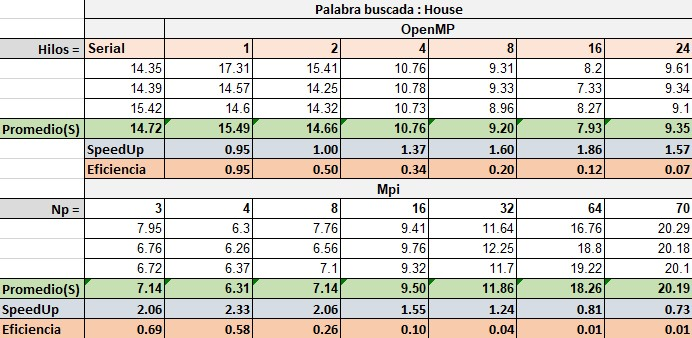
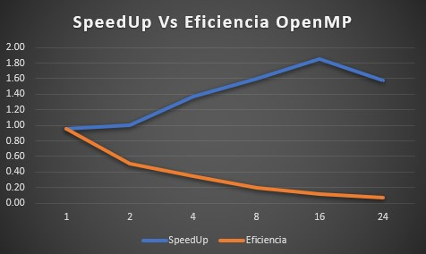
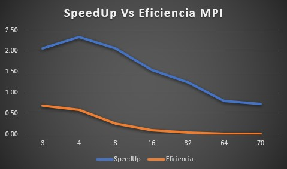

# Text-Analytics
Proyecto 2 tópicos en telemática. 
# Integrantes
  Esteban Echavarría Collazos - eechava6@eafit.edu.co   
  Esteban Perez Noreña - eperezn@eafit.edu.co   
  [VIDEO](https://youtu.be/bKwWz3JZG9g "Video Esteban Perez")  
  
**NOTA:**
Debido a que se ejecuta un procesamiento en Python se generan unos archivos temporales en el directorio propio, por esta razón es necesario compilar todo desde el home del repo Text-Analytics/
* Para Serial/OpenMp 

       [user@hdpmaster Text-Analytics]$  python ./src/python/pre-processing.py
          
* Para MPI

         [user@hdpmaster Text-Analytics]$  python ./src/python/pre-processing-for-mpi.py

# 1. Algoritmo Serial

* [Algoritmo Serial](serial.md)

# 2. Algoritmo Paralelo con OpenMP

* [Algoritmo Paralelo con OpenMP](openmp.md)

# 3. PCAM

* [PCAM](pcam.md)

## Análisis de resultados

- ### Tabla de resultados

- ### Versión serial

Para la palabra "House" la versión serial tardo un promedio de 14.72 segundos (Promedio de 3 ejecuciones). A partir de esta calcularemos el Speedu y Eficiencia de la vesión con OpenMp y MPI

- ### Versión OpenMP

En la versión de OpenMP se evidencia como aunque mejore el SpeedUp, la eficiencia realmente disminuye, se sugiere 2 hilos pues el que presenta la mejor relación entre ambos.

- ### Versión PCAM

En la versión de OpenMP y MPI es posible observar como tanto el SpeedUp como la eficiencia disminuyen a partir de Np = 4, se sugiere dNP = 3 pues el que representa una de las mejores relaciones entre el speedup y la eficiencia.

## Conclusiones

A partir de los datos analizados y la relación costo/beneficio es posible evidenciar como dependiendo del problema puede ser crítico o no la velocidad y el rendimiento, para problemas que soliciten más respuesta inmediata puede justificarse la inversión o el sacrificio de la eficiencia, pero a través del análisis de las versiones, la versión que siempre representara una buena relación entre el SpeedUp y la Eficiencia será 2, el duplicar bien sea los hilos o los procesadores siempre aumenta de manera significativa los resultados sin aumentar demasiado los costos. 
