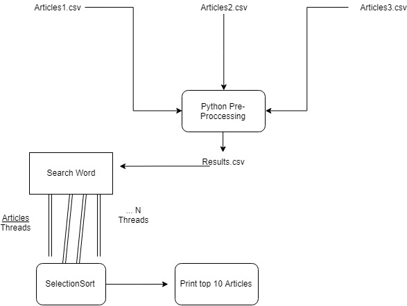
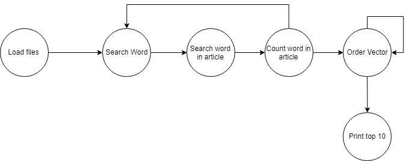

# Descripción del Algoritmo Paralelo con OpenMP

Se tiene un conjunto de noticias en texto libre, sobre el cual se desea calcular:

Índice Invertido, donde por cada palabra que se ingrese por teclado, se liste en orden descendente por frecuencia de palabra en el contenido <content> de la noticia, las noticias más relevantes. Listar máx 10 <frec,doc_id,title>.

        frec = frecuencia de la palabra en la noticia <id>
        id = id de la noticia
        title = título de la noticia.

### Entendimiento del problema

# 1. Análisis
## 1.1 Descripción

La función del algoritmo, es dado 3 documentos que contienen diferentes noticias, listar los 10 registros que contengan la palabra ingresada una mayor cantidad de veces. 

Inicialmente se utilizó una técnica de Pre-procesamiento en python dado que c++ no provee una herramienta que permita la lectura de CSV especificamente.

Se filtran los archivos usando unicamente las columnas ** 1,2 y 9 ** que corresponden al **'Id','title' y 'content'** respectivamente.

**Title** y **Content** se transforman a lowercase(Minúsculas) para no ignorar una palabra si se encuentra en minúsucula, mayúscula o mixto, después de esto se concatenan los 3 archivos en uno solo llamado Results.csv.

Para el algorimo de c++ se hace la lectura del archivo y se procede a crear una struct que sera cada noticia que tiene como argumentos
* 'id'
* 'title'
* 'content'

Se tiene un vector que almacena todas estas noticias ya procesadas, luego se hace la lectura de la palabra ingresada por el usuario y se pasa a lowercase (Minúscula) 

Finalmente, se realiza el conteo de la palabra en las columnas de 'title' y 'content' por cada noticia, para luego dar paso al ordenamiento a través del algoritmo **"SelectionSort"** y la impresión de los resultados 10 primeros resultados del algoritmo.

Para OpenMP se agregaron el uso de procesamiento paralelo en la sección del ** conteo de las palabras ** , el cual es independiente de cualquiera de los otros procesos del algoritmo, por tanto es la unica parte donde se pudo realizar
el procesamiento paralelo, para la lectura del archivo no se agrego porque agregaba más tiempo de ejecución en vez de reducirlo,
para el ordenamiento no es posible dado que para adquirir un arreglo ordenado, es necesario realizar una serie de iteraciones sobre ese mismo arreglo que lo vuelve dependiente de un estado inmediatamente anterior, por lo que aún con hilos, se ejecutaria serialmente. 

Por tanto:

* Lectura de archivo (Se puede paralelizar con OpenMP pero no muestra mejora).

* Conteo de palabras (Fue posible su paralelización con OpenMP y muestra mejora significativa).

* Ordenamiento (No se puede ralizar con OpenMP debido a la dependencia entre las transiciones)
  
Estas son las fases del algoritmo de Text-Analytics.

## 1.2 Grafo de dependencias.

## 1.2 ¿Cómo funciona el algoritmo?
 
* Se debe descargar del github el proyecto
        
        [user@hdpmaster]$ git clone https://github.com/eechava6/Text-Analytics.git

* Luego se accede al directorio para empezar a trabajar sobre este
      
       [user@hdpmaster]$ cd Text-Analytics/
       
* Aqui se deben hacer el pre procesamiento de los datos para que nuestro algoritmo funcione de la manera correcta para lo cual es necesario

       [user@hdpmaster Text-Analytics] $ python src/python/pre-process.py
       
* Una vez ejecutado la anterior linea, nos quedara un archivo csv llamado results que contiene todas las noticias separadas por ";" y en minusculas

* El siguiente paso es compilar el programa openmp en c++
      
       [user@hdpmaster Text-Analytics]$ g++ src/c++/openmp/main.cpp -o openmp -fopenmp
       
* Definir la cantidad de hilos con los cuales se desea ejecutar el algoritmo:

       [user@hdpmaster Text-Analytics]$ export OMP_NUM_THREADS=<NumeroDeHilos>

* Y para ejecutarlo simplemente se ejecuta lo siguiente:

       [user@hdpmaster Text-Analytics]$ ./openmp
          
 
* Si se realizaron los pasos correctamente debe poder ingresarse una palabta que será buscada en los diferentes articulos.
   
## 1.2 Definición de tecnología de desarrollo para el algoritmo:

* Lenguaje de Programación: C++
* Técnica Aplicada: OpenMP
* Biblioteca para hilos: OpenMP
