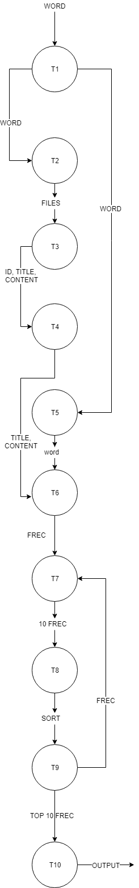

# Metodologia PCAM 

### Entendimiento del problema

### Particionamiento

* T1. Leer la palabra a buscar por consola.
* T2. Enviar palabra a cada slave.
* T3. Leer archivo pre procesado correspondiente.
* T4. Guardar en un struct el id, title y content.
* T5. Transformar palabra a miniscula.
* T6. Conteo de la palabra por cada noticia.
* T7. Guardar en arreglo la frecuencia de esa palabra.
* T8. Buscar los 10 frecuencias mas grandes.
* T9. Ordenar de mayor a menor las frecuencias halladas.
* T10. Imprimir las 10 primeras noticias que mas repitan la palabra a buscar.

### Comunicación

### Aglomeración

### Mapeo 
