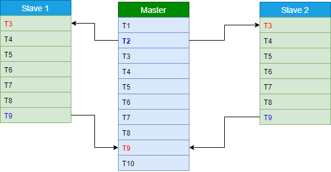

# Metodologia PCAM 

### Entendimiento del problema

### Particionamiento

* T1. Leer la palabra a buscar por consola.
* T2. Enviar palabra a cada slave.
* T3. Leer archivo pre procesado correspondiente.
* T4. Guardar en un struct el id, title y content.
* T5. Transformar palabra a miniscula.
* T6. Conteo de la palabra por cada noticia.
* T7. Guardar en arreglo la frecuencia de esa palabra.
* T8. Buscar los 10 frecuencias mas grandes.
* T9. Ordenar de mayor a menor las frecuencias halladas.
* T10. Imprimir las 10 primeras noticias que mas repitan la palabra a buscar.

### Comunicación

### Aglomeración

* Replicación de datos: { *T1, T2, T10* } En este paso se lleva a cabo la lectura de la palabra a buscar en las noticias y es almacenada en diferentes nodos al ser enviado.
* Tareas de cada cluster: { *T3, T4, T5, T6, T7, T8, T9* } ya que cada uno es respondable de leer el archivo correspondiente buscar las noticiasque mas repiten la palabra y ordenarlos de mayor a menor y luego devolverlo al master.

### Mapeo 

Aca podemos evidenciar que actividades realica cada slave del cluster, y se aprecia que las tareas de color azul, son actividades que envian datos despues de terminar su ejecución, y las de color rojo son actividades que antes de empezar reciben datos, por tanto podemos ver como cada slave es respondable de leer un archivo pre procesado y hacer el conteo y ordenar las 10 primeras noticias que mas registren esa palabra y devolverlo al master, para asi luego mostrar las 10 noticias definitivas.
